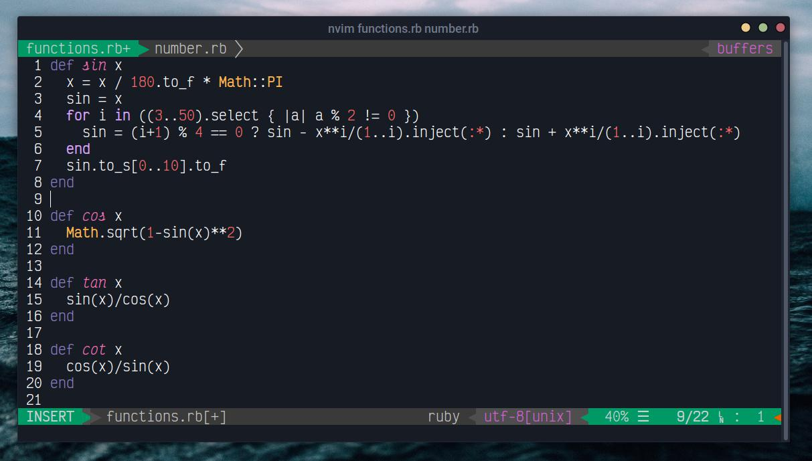

# vim-parkour-theme

 You'll fall in love with this theme soon. *insert Parkour! meme*
 
## Screenshot

## Installation With vim-plug 

Add this line to your vim/neovim config file:

`Plug 'pncborgar/vim-parkour-theme'`

and than in vim, run:

`:PlugInstall`

and then to set the parkour theme as default vim theme, add this to your vim config:

`colorscheme parkour`
## In other editors...
There is also [a port of Parkour! for Visual Studio Code](https://github.com/pncborgar/vscode-parkour-theme/). Have a try.
